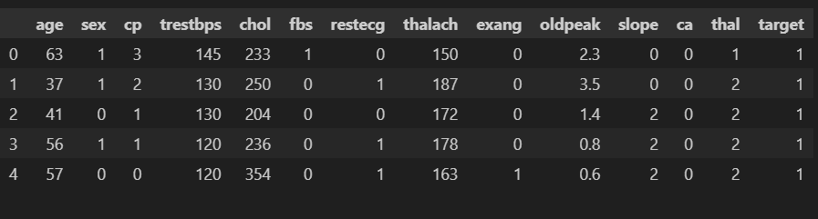
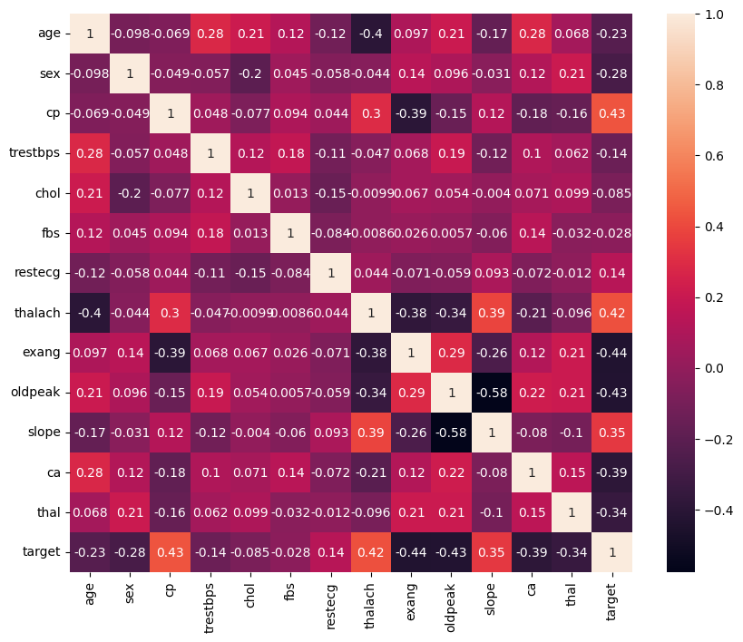
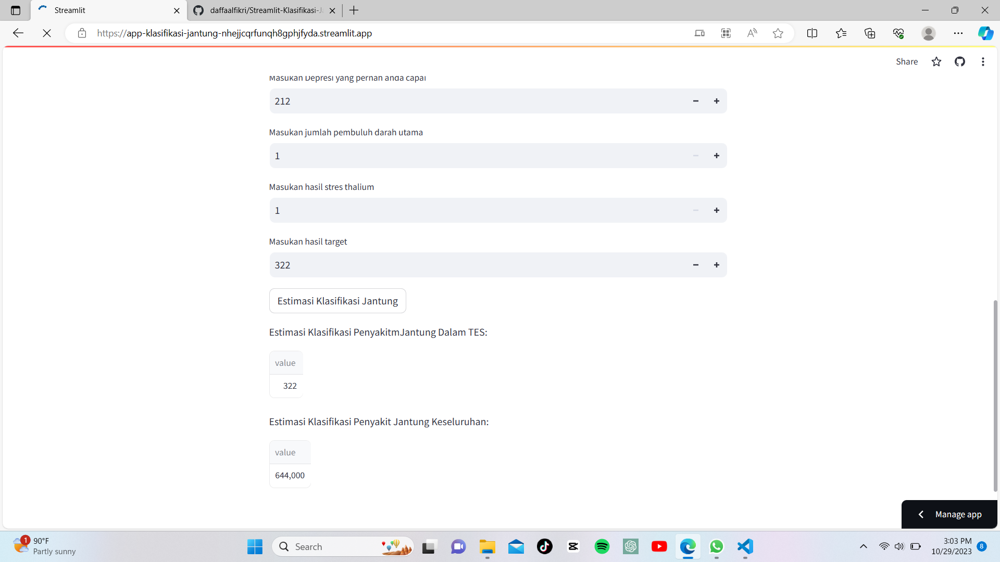

# Laporan Proyek Machine Learning

### Nama : M Daffa Alfikri

### Nim : 211351076

### Kelas : IF Pagi A

## Domain Proyek

Proyek ini dapat digunakan untuk mengidentifikasi tingkat risiko seseorang terkena penyakit jantung berdasarkan faktor-faktor seperti usia, jenis kelamin, riwayat keluarga, tekanan darah, profil lipid, dan Mengidentifikasi mengklasifikasikan berbagai jenis penyakit jantung bawaan pada anak-anak atau orang dewasa.

## Business Understanding

Bisa mengecek tekanan jantung dan darah sebaginya.

### Problem Statements

- Dalam kasus ini, masalah yang saya jelajahi adalah masalah klasifikasi Linear.

Saya akan mencari informasi dan memprediksi apakah seseorang memiliki penyakit jantung atau tidak.

### Goals

- Menemukan Klasifikasi dan infromasi penyakit jantung seseorang terdapat atau tidak.

### Solution statements

- Pengembangan sistem klasifikasi penyakit jantung dan melakukan estimasi rating dari jumlah yang terjangkit penyakit jantung
- Model yang dihasilkan dari datasets itu menggunakan metode Linear Regression.

## Data Understanding

Dataset yang saya gunakan berasal dari Kaggle ..<br>

[Klasifikasi Penyakit Jantung](https://www.kaggle.com/datasets/dharanireddy/heart-disease).

### Variabel-variabel pada Klasifikasi Penyakit Jantung adalah sebagai berikut:

- age - Usia dalam tahun
- sex - (1 = male; 0 = female)
- cp - chest pain type
  0: Typical angina: nyeri dada terkait mengurangi suplai darah ke jantung
  1: Atypical angina: nyeri dada tidak berhubungan dengan jantung
  2: Non-anginal pain: biasanya kejang esofagus (tidak berhubungan dengan jantung)
  3: Asymptomatic: nyeri dada tidak menunjukkan tanda-tanda penyakit
- trestbps - mengistirahatkan tekanan darah (dalam mm Hg saat masuk ke rumah sakit
  di atas 130-140 biasanya memprihatinkan
- chol - serum cholestoral dalam mg/dl
  serum = LDL + HDL + .2 \* triglycerides
  di atas 200 yang memprihatinkan
- fbs - (fasting blood sugar > 120 mg/dl) (1 = true; 0 = false)
  '>126' mg/dL signals diabetes
- restecg - resting electrocardiographic results
  0: Tidak ada yang perlu diperhatikan
  1: ST-T Wave abnormality
  dapat berkisar dari gejala ringan hingga masalah parah
  sinyal detak jantung yang tidak normal
  2: Possible or definite left ventricular hypertrophy
  Ruang pompa utama jantung yang diperbesar
- thalach - denyut jantung maksimum tercapai
- exang - latihan diinduksi angina (1 = yes; 0 = no)
- oldpeak - Depresi ST yang disebabkan oleh olahraga relatif terhadap istirahat
  melihat stres jantung saat berolahraga
  jantung yang tidak sehat akan lebih stres
- slope - kemiringan segmen ST latihan puncak
  0: Upsloping: detak jantung yang lebih baik dengan olahraga (tidak biasa)
  1: Flatsloping: perubahan minimal (jantung sehat yang khas)
  2: Downslopins: tanda-tanda jantung yang tidak sehat
- ca - jumlah pembuluh darah utama (0-3) diwarnai oleh flourosopy
  pembuluh berwarna berarti dokter dapat melihat darah yang melewatinya
  semakin banyak gerakan darah semakin baik (tidak ada gumpalan)
- thal - hasil stres thalium
  1,3: normal
  6: fixed defect: dulu cacat tapi sekarang baik-baik saja
  7: reversable defect: tidak ada gerakan darah yang tepat saat berolahraga
- target - memiliki penyakit atau tidak (1=yes, 0=no) (= atribut yang diprediksi)

## Data Preparation

### Data Collection

Untuk data collection ini, saya mendapatkan dataset yang nantinya digunakan dari website kaggle dengan nama dataset Klasifikasi Penyakit Jantung, jika anda tertarik dengan datasetnya, anda bisa click link diatas.

### Data Discovery And Profiling

Untuk bagian kolom ini kita tambahkan libary terlebih dahulu

```bash
import pandas as pd
import numpy as np
import matplotlib.pyplot as plt
import seaborn as sns
```

Karna kita pakai google coleb,kita pake script seperti yang di bawah,nanti kita tinggal upload file kaggle.json nya.

```bash
from google.colab import files
files.upload()
```

Setelah mengupload filenya, maka kita akan lanjut dengan menyimpan file kaggle.json yang sudah diupload tadi

```bash
!mkdir -p ~/.kaggle
!cp kaggle.json ~/.kaggle/
!chmod 600 ~/.kaggle/kaggle.json
!ls ~/.kaggle
```

Dan setelah itu kita download dataset terlebih dahulu.

```bash
!kaggle datasets download -d dharanireddy/heart-disease
```

Setelah download file dataset tadi kita akan Meng Extract file dataset yang telah kita download tadi

```bash
!unzip heart-disease.zip -d heart
!ls heart
```

Klik file yang telah di extract lalu salin file csv nya dengan nama Copy path atau salin jalur dan paste di bawah ini

```bash
df = pd.read_csv("/content/heart/heart.csv")
```

kita akan melihat dataset

```bash
df.head()
```



Selanjutnya kita akan memeriksa apakah datasetsnya terdapat baris yang kosong atau null dengan menggunakan seaborn

```bash
df.info()
```

```bash
df.isna().sum()
```

- age 0
- sex 0
- cp 0
- trestbps 0
- chol 0
- fbs 0
- restecg 0
- thalach 0
- exang 0
- oldpeak 0
- slope 0
- ca 0
- thal 0
- target 0
  dtype: int64

```bash
plt.figure(figsize=(10,8))
sns.heatmap(df.corr(),annot=True)
```



```bash
df.head()
```

kita lihat lagi dataset nya apakah berubah atau tidak

```bash
df.info()
```

### Feature

Semua kolom tidak memiliki nilai dan memiliki kolom dan tidak mengandung syntax

Feature bisa di gunakan menghitung parameter estimasi

```bash
features = ['age', 'sex', 'cp', 'trestbps', 'chol', 'fbs', 'restecg', 'thalach', 'exang','oldpeak', 'slope', 'ca', 'thal','target']
x = df[features]
y = df['target']
x.shape, y.shape
```

```bash
x_test.shape
```

(152, 14)

# Modeling

sebelumnya mari kita import library yang nanti akan digunakan,

```bash
from sklearn.linear_model import LinearRegression
lr = LinearRegression()
lr.fit(x_train,y_train)
pred = lr.predict(x_test)
```

Lalu berikut adalah skor akurasi dari model yang kita buat

```bash
score = lr.score(x_test,y_test)
print('Akurasi model Regresi Linear', score)
```

Akurasi model Regresi Linear 1.0

```bash
print(x)
```

```bash
input_data = np.array([[63,1,3,145,233,1,0,150,0,2.3,0,0,1,1]])

prediction = lr.predict(input_data)
print('Estimasi Hasil Penyakit Jantung :',prediction)
print('Nilai Klasifikasi Penyakit Jantung adalah : 6')
```

# Evaluation

Hitung R-kuadrat (R^2): Untuk menghitung R-kuadrat, Anda dapat menggunakan rumus berikut:

R^2 = 1 - (SSR / SST)

SSR (Sum of Squared Residuals) adalah jumlah perbedaan kuadrat antara nilai aktual dan nilai prediksi.
SST (Total Sum of Squares) adalah jumlah perbedaan kuadrat antara nilai aktual dan rata-rata nilai aktual

Rumus :

RMSE = sqrt((1/n) \* Σ(aktual - diprediksi)^2)

```bash
from sklearn.metrics import r2_score
from sklearn.metrics import mean_squared_error

print('R2:', r2_score(y_test,pred))
print('RMSE:', np.sqrt(mean_squared_error(y_test, pred)))
```

# Deployment

[Estimasi Klasifikasi Penyakit Jantung](https://app-klasifikasi-jantung-nhejjcqrfunqh8gphjfyda.streamlit.app/)


